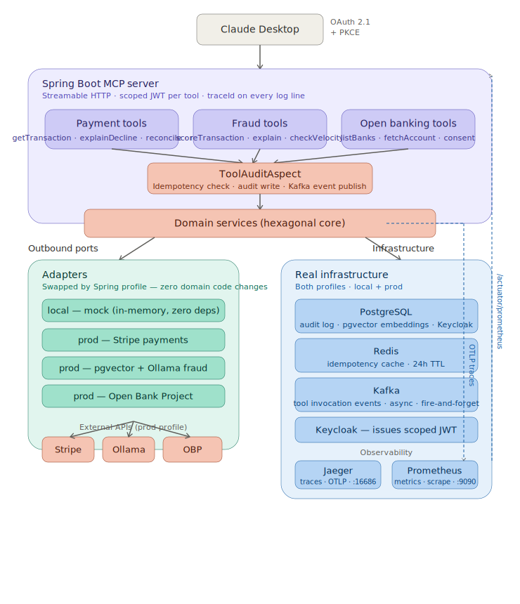

# FinSight MCP — AI-Native Financial Intelligence Server

A production-grade **Model Context Protocol (MCP) server** that exposes financial intelligence tools to AI agents. Built with Spring Boot 4.1, Java 21, and hexagonal architecture. Connects Claude Desktop directly to real payment, fraud, and open banking APIs.

---

## What It Does

FinSight MCP gives AI agents like Claude Desktop 11 financial tools across three domains:

| Domain | Tools | Adapters |
|---|---|---|
| **Payments** | `getTransaction`, `explainDecline`, `reconcileTransactions`, `analyzePaymentRoute` | Mock / Stripe |
| **Fraud** | `scoreTransaction`, `explainFraudSignals`, `checkVelocity` | Mock (rules) / pgvector + Ollama |
| **Open Banking** | `listConnectedBanks`, `fetchAccountData`, `fetchAllAccounts`, `checkConsent` | Mock / Open Bank Project |

**Example interaction with Claude Desktop:**
> *"Why was payment pi_3RfXxxx declined, and what's the fraud risk?"*
> → Claude calls `explainDecline` + `scoreTransaction` and returns a combined analysis

---

## Architecture


**Key design decisions:**
- **Hexagonal architecture** — domain logic is completely isolated from adapters. Swap `MockPaymentAdapter` → `StripePaymentAdapter` by changing one Spring profile.
- **AOP-based audit** — `ToolAuditAspect` intercepts every `@Tool` method for idempotency, audit logging, and Kafka event publishing without touching tool code.
- **OAuth 2.1 with PKCE** — Claude Desktop authenticates via Keycloak using the full authorization code flow. Token proxy strips RFC 8707 `resource` parameter (not yet supported by Keycloak).
- **pgvector AI fraud** — Ollama generates 768-dimension embeddings; pgvector cosine similarity finds historical fraud patterns.

---

## Module Structure

```
finsight-mcp/
├── finsight-core/              # Domain model, ports (interfaces), services
├── finsight-infra/             # PostgreSQL audit, Redis idempotency, Kafka events
├── finsight-adapters/
│   ├── adapter-mock/           # In-memory mock adapters for local development
│   ├── adapter-stripe/         # Real Stripe payment adapter
│   ├── adapter-pgvector/       # AI fraud scoring: Ollama embeddings + pgvector
│   └── adapter-obp/            # Real open banking: Open Bank Project sandbox
└── finsight-mcp-server/        # Spring Boot app, MCP tools, OAuth config
```

---

## Profiles

| Profile | Adapters | JWK Source | Use For |
|---|---|---|---|
| `local` | Mock (all) | localhost:8180 | `make mcp-test-*` — no ngrok needed |
| `prod` | Stripe + pgvector + OBP | Keycloak ngrok | Claude Desktop + Stripe testing |

---

## Prerequisites

### Always required
- Java 21+
- Docker + Docker Compose
- `jq`

### For `prod` profile only

- **A public URL** for both the FinSight server and Keycloak, so Claude Desktop (which runs outside your machine's network) can reach them. Any tunneling tool or reverse proxy with a stable HTTPS URL works here — this project uses [ngrok](https://ngrok.com) for local testing since it's quick to set up with no DNS/cert configuration needed. In a real deployment these would be actual domains behind a load balancer.
- **Ollama**, running locally to generate fraud-detection embeddings:
  ```bash
  brew install ollama          # or see https://ollama.ai for other platforms
  ollama serve                 # starts the Ollama server on localhost:11434
  ollama pull nomic-embed-text # downloads the embedding model (~270MB)
  ```
  Verify it's running: `curl http://localhost:11434/api/tags`
- Stripe account (free sandbox): [stripe.com](https://stripe.com)
- Open Bank Project sandbox account: [apisandbox-portal.openbankproject.com](https://apisandbox-portal.openbankproject.com)

---

## Quick Start

### 1. Clone and build

```bash
git clone https://github.com/your-username/finsight-mcp.git
cd finsight-mcp
./mvnw install -DskipTests
```

### 2. Start infrastructure

```bash
make infra
```

Starts PostgreSQL, Redis, Kafka, Keycloak. Waits until all services are healthy (~60s for Keycloak).

### 3. Start app (local profile — mock adapters)

```bash
make app
```

### 4. Run all tool tests

```bash
make mcp-test-all
```

---

## Prod Profile Setup

### Environment variables

Add to `~/.zshrc`:

```bash
# ngrok URLs — update when tunnels restart
export FINSIGHT_PUBLIC_URL="https://xxxx-xx-xx-xx-xx.ngrok-free.app"
export KEYCLOAK_PUBLIC_URL="https://yyyy-xx-xx-xx-xx.ngrok-free.app"

# Stripe sandbox
export STRIPE_API_KEY="sk_test_..."

# Open Bank Project
export OBP_CONSUMER_KEY="your-consumer-key"
export OBP_USERNAME="your-obp-username"
export OBP_PASSWORD="your-obp-password"
```

### Expose a public URL (for Claude Desktop)

Claude Desktop needs to reach FinSight and Keycloak over the public internet. For local testing, ngrok is the fastest way to get an HTTPS URL pointing at your machine:

```bash
# Terminal 1 — FinSight
ngrok http 8080

# Terminal 2 — Keycloak
ngrok http 8180
```

(Any equivalent — Cloudflare Tunnel, a reverse-proxied VPS, a real deployed domain — works the same way; just put that URL in the env vars below instead.)

Update env vars with the new URLs, then restart Keycloak so it advertises the correct issuer:

```bash
source ~/.zshrc
docker-compose restart keycloak
```

### Start app (prod profile)

```bash
make app-prod
```

---

## Claude Desktop Integration

### Connect FinSight to Claude Desktop

1. Open Claude Desktop → **Settings** → **Integrations**
2. Click **Add custom integration**
3. Enter the public URL from your tunnel (or domain), e.g. `https://your-public-url/mcp`
4. Enter OAuth Client ID: `claude-desktop`
5. Leave Client Secret empty (public PKCE client)
6. Log in with: `agent-full` / `agent123`

### Example conversations

```
"Score transaction txn-005 for fraud risk"
→ CRITICAL risk (1.0), 4 signals: HIGH_AMOUNT, GEO_MISMATCH, VELOCITY_CHECK, DECLINE_PATTERN

"Why was pi_3RfXxxx declined?"
→ Real Stripe decline explanation with remediation advice

"List connected banks in Germany"
→ Returns real banks from Open Bank Project (199 available)

"What's the balance of test-bank/fgarcia_account1?"
→ Real account data: 990.00 EUR, VALID consent

"Analyze the best payment route for 3200 EUR to a US merchant"
→ Route recommendation with success probability and fee comparison
```

---

## MCP Tools Reference

### Payment Tools

| Tool | Description | Key Arguments |
|---|---|---|
| `getTransaction` | Fetch transaction details | `transactionId` |
| `explainDecline` | Human-readable decline explanation | `transactionId` |
| `reconcileTransactions` | List transactions by time window | `hoursBack`, `statusFilter` |
| `analyzePaymentRoute` | Optimal acquirer/PSP routing | `amount`, `currency`, `countryCode`, `paymentMethod` |

### Fraud Tools

| Tool | Description | Key Arguments |
|---|---|---|
| `scoreTransaction` | Risk score 0.0–1.0 with signals | `transactionId` |
| `explainFraudSignals` | Human-readable signal breakdown | `transactionId` |
| `checkVelocity` | Transaction velocity check | `dimension` (IP/CARD/DEVICE), `value`, `windowMinutes` |

### Open Banking Tools

| Tool | Description | Key Arguments |
|---|---|---|
| `listConnectedBanks` | Available banks by country | `countryCode` |
| `fetchAccountData` | Account balance and consent | `accountId` (local: `acc-de-001`, prod: `bank/accountId`) |
| `fetchAllAccounts` | All accounts for a requisition | `requisitionId` (local: `req-demo-001`, prod: bank ID) |
| `checkConsent` | PSD2 consent status | `accountId` |

---

## Infrastructure

| Service | Port | Purpose |
|---|---|---|
| PostgreSQL | 5432 | Audit logs, transaction embeddings (pgvector) |
| Redis | 6379 | Idempotency cache (24h TTL) |
| Kafka | 29092 | Tool invocation events |
| Keycloak | 8180 | OAuth 2.1 authorization server |
| Kafka UI | 8090 | Browse Kafka topics |
| Redis UI | 8001 | Browse Redis keys |
| Spring Boot | 8080 | MCP server |

### What each piece is actually doing

**PostgreSQL** is split into three logical roles via schemas:
- `audit` schema — every tool call (success/failure, duration, tenant, errors) is written here by `PostgresAuditAdapter`, queryable for compliance and debugging.
- `finsight` schema (pgvector) — stores 768-dimension transaction embeddings generated by Ollama. `PgVectorFraudAdapter` does cosine-similarity search over this table to find historically similar fraud patterns — this is what makes the `prod` profile's fraud scoring AI-native rather than rule-based.
- `keycloak` schema — Keycloak's own realm/user/client state.

**Redis** backs the idempotency layer (`RedisIdempotencyAdapter`). MCP tool calls are wrapped by `ToolAuditAspect`, which hashes the tool name + arguments + tenant into a cache key. If an AI agent retries a call (a common failure mode — timeouts, network blips), the second call returns the cached response instead of re-executing, so retries can't double-charge a card or double-flag a transaction.

**Kafka** receives a `ToolInvocationEvent` for every tool call via `ToolInvocationEventPublisher`, fired asynchronously so it never adds latency to the tool response. This is the seam for anything downstream — real-time dashboards, ML training data collection, billing/metering per tenant — none of which exists yet, but the event stream is already there.

**Keycloak** is the OAuth 2.1 authorization server. It issues scoped JWTs (`payment:read`, `fraud:read`, `banking:read`) that `SecurityConfig` enforces per-tool via `@PreAuthorize`, and it's also where the `tenant_id` claim originates (via a custom protocol mapper), which `TenantContextFilter` reads on every request to scope all data access.

---

## Security

- **OAuth 2.1 + PKCE** — no client secrets for public clients
- **JWT scopes** — `payment:read`, `fraud:read`, `banking:read` enforced via `@PreAuthorize`
- **Multi-tenancy** — `tenant_id` claim extracted from JWT, all data scoped per tenant
- **Idempotency** — Redis prevents duplicate tool executions from agent retry loops
- **Audit trail** — every tool call logged to PostgreSQL with tenant, duration, status

---

## Testing

### Run all integration tests

```bash
./mvnw test -pl finsight-mcp-server
```

38 tests across 5 test classes using Testcontainers (PostgreSQL + Redis + Kafka):

| Test Class | Tests | Covers |
|---|---|---|
| `ToolAuditAspectIT` | 4 | Flyway migrations, audit schema |
| `PaymentToolsIT` | 9 | All 4 payment tools |
| `FraudToolsIT` | 10 | All 3 fraud tools |
| `OpenBankingToolsIT` | 8 | All 4 open banking tools |
| `IdempotencyIT` | 7 | Redis cache store/retrieve/lock |

### Run MCP tool tests (local profile)

```bash
make mcp-test-all          # all 12 tools
make mcp-test-fraud        # scoreTransaction (txn-005, CRITICAL)
make mcp-test-decline      # explainDecline (txn-002, insufficient funds)
make mcp-test-banks        # listConnectedBanks (Germany)
```

### Stripe sandbox tests (prod profile)

```bash
make stripe-test-full                    # create → decline → explain
make stripe-create-declined              # create a declined PaymentIntent
make stripe-test-get PI=pi_xxx          # fetch real transaction
make stripe-test-decline PI=pi_xxx      # explain real decline
make stripe-fraud-full                   # create → score fraud → explain signals
```

---

## Makefile Reference

```bash
make infra              # Start all infrastructure
make infra-down         # Stop all services
make infra-clean        # Wipe all volumes

make app                # local profile — mock adapters
make app-prod           # prod profile — real adapters + Claude Desktop

make token-full         # Get JWT with all scopes
make decode-token       # Inspect JWT claims
make keycloak-ready     # Check Keycloak health

make mcp-test-all       # Run all 12 tool tests
make mcp-list-tools     # List registered tools

# Override account IDs for prod profile
make mcp-test-account ACCOUNT_ID=test-bank/fgarcia_account1
make mcp-test-all-accounts REQUISITION_ID=test-bank
```

---

## Tech Stack

| Layer | Technology |
|---|---|
| Language | Java 21 (virtual threads, records, pattern matching) |
| Framework | Spring Boot 4.1, Spring AI 2.0 |
| MCP Protocol | Spring AI MCP Server (Streamable HTTP) |
| Auth | Keycloak 25, OAuth 2.1, PKCE |
| Database | PostgreSQL 16 + pgvector extension |
| Cache | Redis 7 |
| Messaging | Apache Kafka |
| AI/Embeddings | Ollama + nomic-embed-text (768 dims) |
| Payments | Stripe API |
| Open Banking | Open Bank Project sandbox |
| Testing | JUnit 5, Testcontainers, Mockito |
| Build | Maven, Docker Compose |